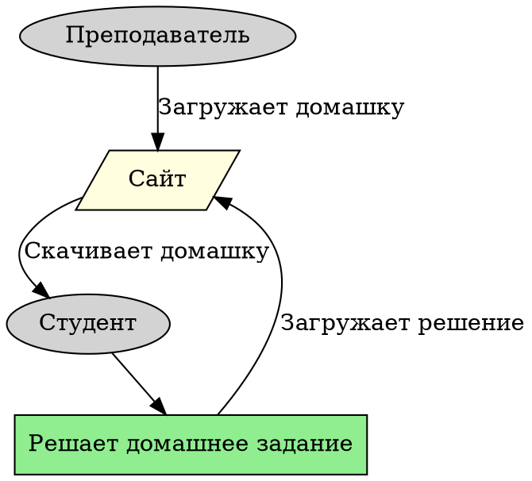

# Генерация блок-схем



### **Шаг 1 – Заходим в ChatGPT**

Первым делом нужно зайти в **ChatGPT** (или любой другой ИИ), который умеет создавать код.


<mark style="color:red;">**Главное – чтобы ChatGPT сгенерировал схему именно на языке DOT**</mark><mark style="color:red;">, так как этот формат поддерживается большинством инструментов для рендеринга блок-схем.</mark>


***

### **Шаг 2 – Отправляем запрос**

Теперь нужно написать правильный **промт** в ChatGPT, чтобы он создал нужную диаграмму.

Пример запроса:


```
для схемы dot, сделай мне какой-нибудь пример блок-схемы про то, что студент получает домашку, её решает и закидывает на сайт, откуда он и скачал, а на этот сайт домашку эту закидывает препод. 
Тип схемы: Статичная диаграмма
```


После этого ChatGPT выдаст готовый код для схемы.

***

### **Шаг 3 – Получаем код**

ChatGPT отправит вам **код на языке DOT**, который можно сразу вставлять в рендеринг-системы.

Пример кода:





<figure><figcaption></figcaption></figure>

***

### **Шаг 4 – Рендеринг схемы**

Теперь, когда код у нас есть, его нужно превратить в картинку. Для этого воспользуемся сайтом:



Что делать дальше:

1. Открываем сайт.
2. Вставляем код в левую часть экрана.
3. Выбираем нужный **движок** для рендеринга.

***

### **Меню движков и их особенности**

<figure><figcaption></figcaption></figure>

В верхнем меню можно выбрать тип рендеринга схемы. Доступны следующие движки:

* **dot** – классическая иерархическая схема, подходит в 90% случаев.
* **circo** – делает графы круглыми, иногда красиво группирует элементы.
* **fdp** – раскладывает элементы более свободно.
* **neato, twopi, sfdp** – экспериментальные варианты, можно попробовать.

Также в меню можно выбрать формат сохранения схемы: **PNG, SVG, PDF и другие**.

***

### <mark style="color:green;">**Готово!**</mark>

Теперь у вас есть **готовая блок-схема**, которую можно скачивать, редактировать или встраивать в документы. Этот метод помогает быстро создавать наглядные схемы без сложных инструментов.

<figure><figcaption></figcaption></figure>
