# GitBook - Документируй что хочешь

Давайте подумаем, что вам приходит в голову при слове «_документация_»? Может быть, огромные **ГОСТ**-документы, написанные _`Times New Roman`_? Или конспекты по математике с <mark style="color:yellow;">жёлтыми</mark> страницами? На самом деле, документация бывает разной - и игровой, и технической, и просто информационной. Пример такой документации вы видите прямо сейчас: эта страница написана на платформе **GitBook**.

<details>

<summary>Справка о GitBook</summary>

GitBook официально является отдельным проектом. Да, вы могли подумать, что раз в названии есть Git - значит это от разработчиков GitHub, но это не так. Если GitHub был сделан компанией **GitHub Inc.** (основан в 2008, выкуплен Microsoft в 2018), то GitBook сделан **GitBook Limited** (в 2014 году и до сих пор остаётся независимой компанией).

Изначально GitBook - это была просто консольная утилита на Node.js (как `gitbook-cli`), которая собирала книги из Markdown в HTML, PDF и ePub. Она до сих пор валяется на GitHub, но разработка давно заброшена. Отсылка в названии **Git**Book - потому что изначально всё хранилось в репозиториях Git. GitHub тут ни при чём, просто удачно совпало.

**Кстати про открытость:** сам GitBook как платформа - закрытый, а вот движок опубликованных сайтов (то, что видит пользователь) - открыт. Код можно глянуть на GitHub и даже предлагать правки.

</details>

### Примеры документации









Это несколько примеров, которые я нашёл публично на просторах Google.

## Первое знакомство

Заходим на сайт Gitbook и логинимся обычным способом (можно через Google или GitHub).



<div data-with-frame="true"><figure>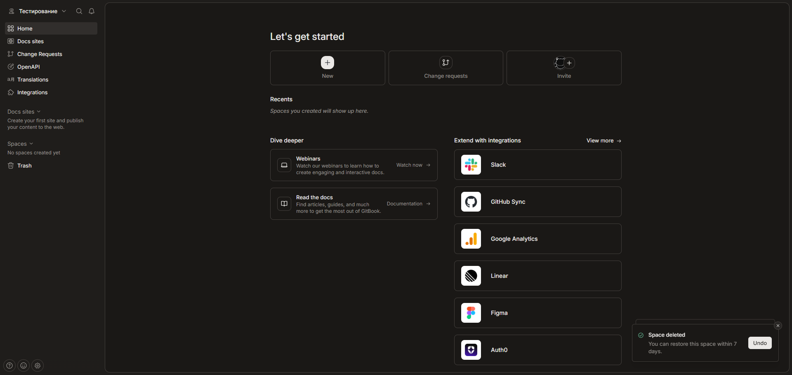<figcaption></figcaption></figure></div>

Сверху по центру будет надпись **"Let's get started"**, а ниже три кнопки: **"New"**, **"Change requests"** и **"Invite"**. Нам нужна первая - жмём **"New"**, и в открывшемся меню выбираем **"New docs site"**.

<div data-with-frame="true"><figure>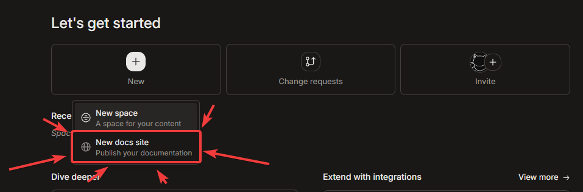<figcaption></figcaption></figure></div>

После этого нужно дать название нашему сайту (оно же станет частью ссылки). Для примера я напишу **`test`**.

<div data-with-frame="true"><figure>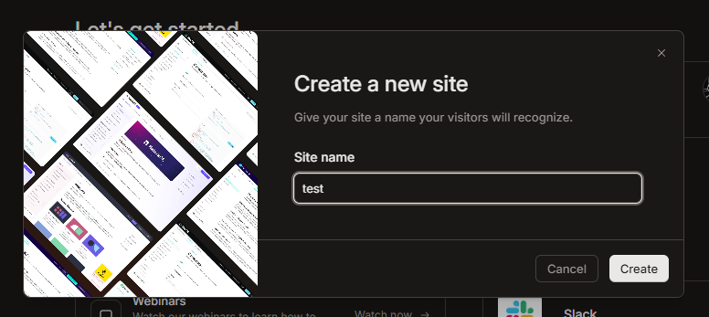<figcaption></figcaption></figure></div>

GitBook предложит создать первую страницу. Можно импортировать готовую, но для первого раза лучше нажать **"blank"** (создать пустую документацию).

<div data-with-frame="true"><figure>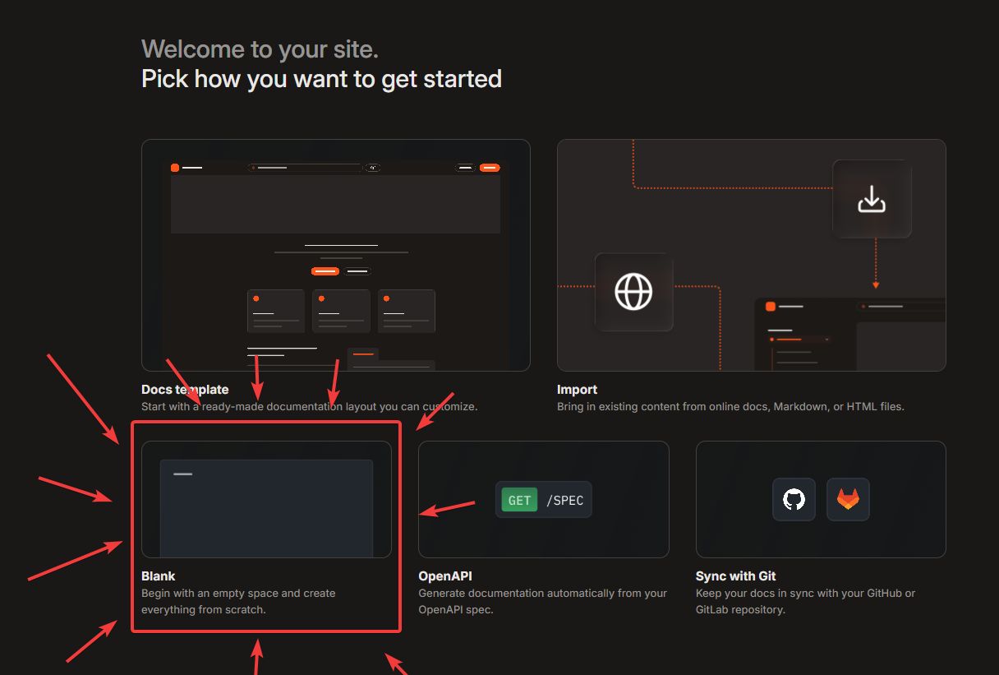<figcaption></figcaption></figure></div>


<mark style="color:$warning;">При создании сайта вам даётся пробный период к премиум-функциям, но для чистоты инструкции они здесь не показываются - только бесплатный доступ.</mark>


Спустя пару секунд нас перебросит на страницу настройки сайта. Давайте сразу его опубликуем, нажав **"Publish your site"**.

<div data-with-frame="true"><figure>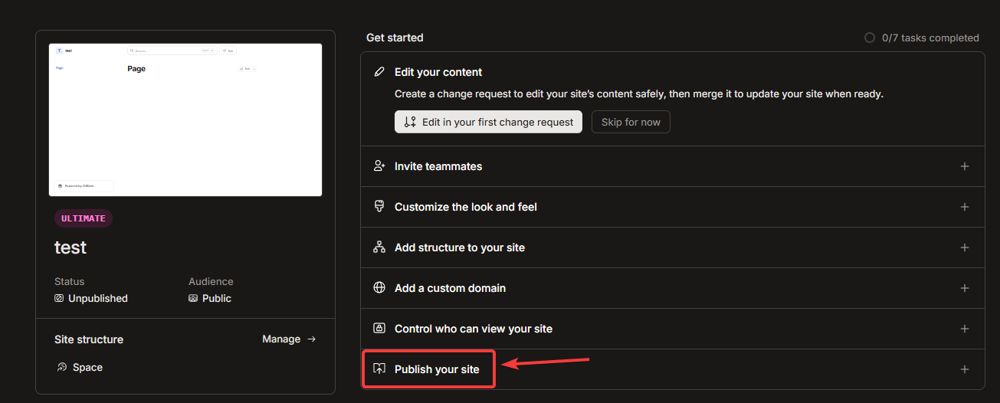<figcaption></figcaption></figure></div>

Теперь после публикации в поле **"URL"** появится ссылка на вашу веб-страницу с документацией. В моём случае это `testirovanie.gitbook.io/test`.

<div data-with-frame="true"><figure>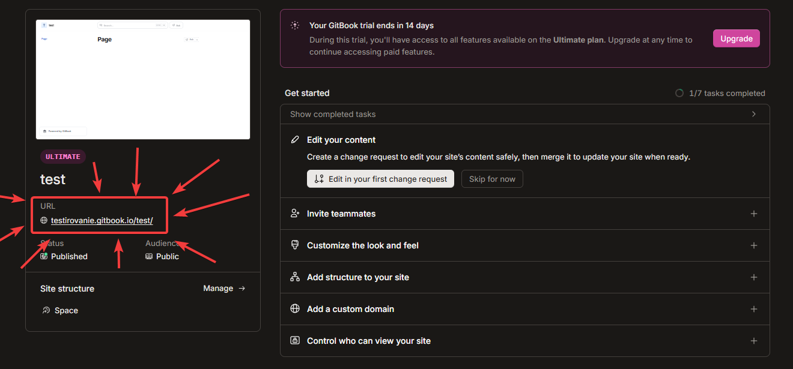<figcaption></figcaption></figure></div>

Но сайт пока пустой, так что давайте это исправим.

### Наполняем контентом

Слева находится боковая панель (в GitBook это называется **Spaces**). Раскрываем папку и видим раздел **"Docs"**. Его можно переименовать как угодно, но пока оставим как есть.

<div data-with-frame="true"><figure>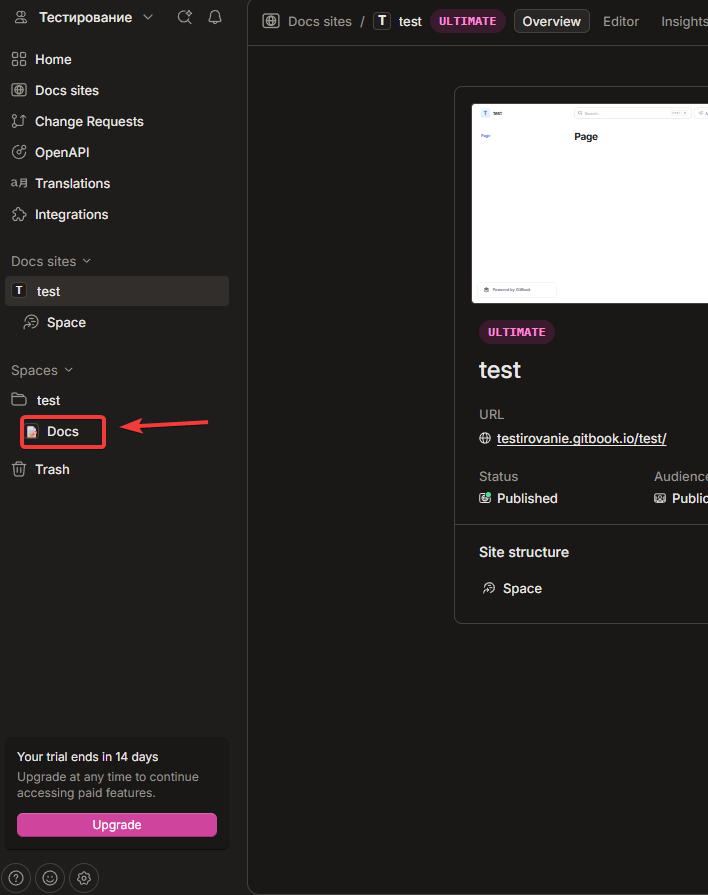<figcaption></figcaption></figure></div>

Чтобы начать редактирование, жмём справа сверху кнопку **"Edit"**.

<div data-with-frame="true"><figure>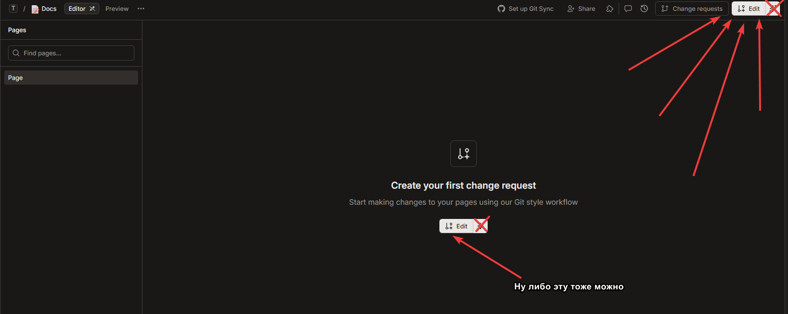<figcaption></figcaption></figure></div>

Теперь мы в редакторе. Сверху можно заменить название страницы (по умолчанию **"Page"**) на что-то осмысленное - например, **"Страница 1"** или **"Что такое яблоко"**. \
Слева от названия есть иконка эмодзи - по ней можно кликнуть и выбрать подходящий. Если пишете про яблоки, логично поискать по слову **"Apple"**.

<div data-with-frame="true"><figure><figcaption></figcaption></figure></div>

Под заголовком есть поле **"Page description"** - это описание страницы, которое отображается чуть прозрачным текстом под названием.

<div data-with-frame="true"><figure>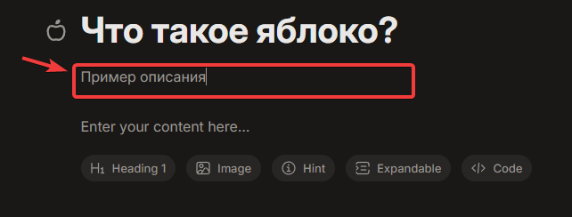<figcaption></figcaption></figure></div>

Теперь про наполнение. GitBook использует **Markdown** - тот же язык разметки, что и в GitHub для файлов `readme.md`, или в Discord для форматирования текста.

<details>

<summary>Справка по Markdown</summary>

**Markdown** — это язык разметки, который превращает обычный текст в красиво оформленный. Его используют везде: GitHub, GitBook, Discord, Telegram (в режиме форматирования), заметки и документация.

Главный плюс — он читается даже в сыром виде и не требует сложных тегов как в HTML.

***

### 1. Заголовки

Заголовки делаются решётками `#` в начале строки. Чем больше решёток — тем меньше заголовок.

```
# H1 — самый большой заголовок
## H2 — подзаголовок
### H3 — раздел
#### H4 — подраздел
##### H5 — мелкий заголовок
###### H6 — совсем мелкий
```

**Как выглядит:**

## H1 — самый большой заголовок

### H2 — подзаголовок

#### H3 — раздел

**H4 — подраздел**

**H5 — мелкий заголовок**

**H6 — совсем мелкий**

> В GitBook заголовки автоматически появляются в оглавлении справа.

***

### 2. Текст и форматирование

Обычный текст пишется как есть. Чтобы перенести строку, нужно поставить **два пробела в конце строки** и нажать Enter.

**Жирный текст** — обрамляется `**двумя звёздочками**` или `__двумя подчёркиваниями__`

_Курсив_ — обрамляется `*одной звёздочкой*` или `_одним подчёркиванием_`

_**Жирный курсив**_ — `***три звёздочки***`

~~Зачёркнутый~~ — `~~две тильды~~`

`Выделенный код` — обратные кавычки `` `вот так` ``

**Пример:**

```
Обычный текст.  
**Жирный текст**  
*Курсив*  
***Жирный курсив***  
~~Зачёркнуто~~  
`git status`
```

**Как выглядит:** Обычный текст.\
**Жирный текст**\
&#xNAN;_&#x41A;урсив_\
&#xNAN;_**Жирный курсив**_\
~~Зачёркнуто~~\
`git status`

***

### 3. Списки

#### Ненумерованные (маркированные)

Ставятся звёздочкой `*`, плюсом `+` или минусом `-` в начале строки.

```
* Пункт 1
* Пункт 2
  * Вложенный пункт (два пробела или таб)
* Пункт 3
```

**Как выглядит:**

* Пункт 1
* Пункт 2
  * Вложенный пункт
* Пункт 3

#### Нумерованные

Ставятся цифрой с точкой. Цифры могут быть любыми — Markdown сам проставит порядок.

```
1. Первый пункт
2. Второй пункт
   1. Вложенный (три пробела)
3. Третий пункт
```

**Как выглядит:**

1. Первый пункт
2. Второй пункт
   1. Вложенный
3. Третий пункт

***

### 4. Ссылки

```
[Текст ссылки](https://example.com)
[Текст с подсказкой](https://example.com "Всплывающий текст")
Просто ссылка: <https://example.com>
```

**Как выглядит:** [Текст ссылки](https://example.com)\
[Текст с подсказкой](https://example.com) — наведи мышкой\
Просто ссылка: [https://example.com](https://example.com)

***

### 5. Картинки

Почти как ссылка, только с восклицательным знаком в начале.

```


```

В GitBook можно просто перетащить картинку в редактор — она сама вставится.

***

### 6. Цитаты

Ставятся знаком `>` в начале строки. Можно делать вложенные.

```
> Это цитата. Обычно выделяется цветом или полосой слева.
> Можно писать в несколько строк.

>> Вложенная цитата (два >)
```

**Как выглядит:**

> Это цитата. Обычно выделяется цветом или полосой слева. Можно писать в несколько строк.
>
> > Вложенная цитата

***

### 7. Код

#### Внутри строки

Обратные кавычки: `` `const x = 10;` ``

#### Блок кода

Три обратные кавычки до и после. Можно указать язык — будет подсветка.

\`\`\`javascript function hello() { console.log("Привет, мир!"); } \`\`\`

**Как выглядит:**

```javascript
function hello() {
  console.log("Привет, мир!");
}
```

В GitBook есть отдельный блок "Code" — можно вставить и выбрать язык.

***

### 8. Таблицы

Таблицы делаются через вертикальные чёрточки `|` и дефисы `-`.

```
| Имя   | Возраст | Город     |
|-------|---------|-----------|
| Анна  | 25      | Москва    |
| Иван  | 30      | Санкт-Петербург |
| Олег  | 22      | Казань    |
```

**Как выглядит:**

| Имя  | Возраст | Город           |
| ---- | ------- | --------------- |
| Анна | 25      | Москва          |
| Иван | 30      | Санкт-Петербург |
| Олег | 22      | Казань          |

Можно выравнивать текст:

* `:---` — по левому краю
* `:---:` — по центру
* `---:` — по правому краю

```
| Лево | Центр | Право |
|:-----|:-----:|------:|
| текст | текст | текст |
```

***

### 9. Разделители

Три дефиса `---` или три звёздочки `***` создают горизонтальную линию.

```
---
```

### **Как выглядит:**

***

### 10. Экранирование

Если нужно показать служебный символ как обычный (например, звёздочку), ставим обратный слеш перед ним.

```
\*звёздочка\* а не курсив
```

**Как выглядит:** \*звёздочка\* а не курсив

***

### 11. Чек-листы (задачи)

В некоторых реализациях (GitHub, GitBook) работают чек-боксы.

```
- [ ] Несделанная задача
- [x] Сделанная задача
```

**Как выглядит:**

* [ ] Несделанная задача
* [x] Сделанная задача

***

### 12. Подсказки (в GitBook)

В GitBook есть специальные блоки — вызываются через `/hint` или в меню вставки.

> 💡 **Совет:** Если хочешь быстро освоить Markdown — пиши прямо в GitBook и смотри, что получается. Там всё наглядно.

***

### Шпаргалка (самое частое)

| Эффект      | Как написать   |
| ----------- | -------------- |
| Заголовок   | `# Текст`      |
| Жирный      | `**текст**`    |
| Курсив      | `*текст*`      |
| Ссылка      | `[текст](url)` |
| Картинка    | ``  |
| Код         | `` `код` ``    |
| Цитата      | `> текст`      |
| Список      | `* пункт`      |
| Разделитель | `---`          |

</details>

Если вы пишете обычный текст и хотите его оформить, наведите курсор на абзац - слева появится значок **шесть точек**. Нажав на него, можно превратить абзац в заголовок (H1, H2, H3) или другой тип блока.

<div data-with-frame="true"><figure>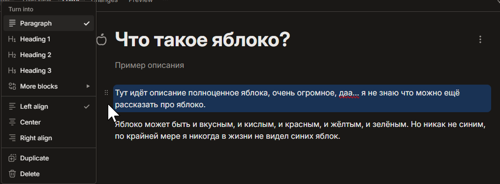<figcaption></figcaption></figure></div>

Левее от шести точек есть **плюсик** - он добавляет новый блок прямо под текущим. А если выделить кусок текста, над ним появится меню форматирования: можно сделать **жирным**, _курсивным_, поменять цвет и так далее.

<div data-with-frame="true"><figure>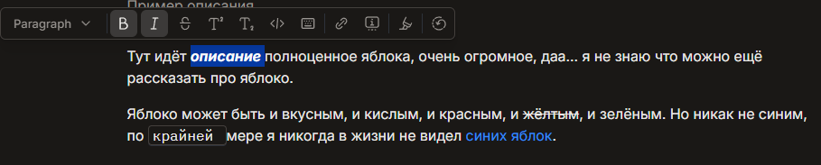<figcaption></figcaption></figure></div>

Справа от шести точек - иконка **«+»** (ещё один плюс). Он открывает меню вставки разных блоков: подсказки (hint), код, таблицы, диаграммы и многое другое. Советую просто потыкать и посмотреть, что там есть - это реально интересно и полезно.

<div data-with-frame="true"><figure>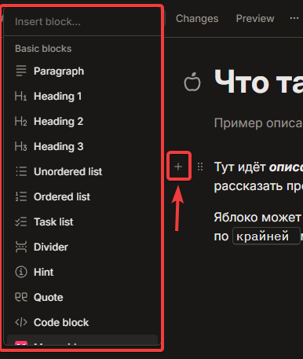<figcaption></figcaption></figure></div>


## Интересный факт

Нейросети вроде **DeepSeek**, **ChatGPT**, **Qwen**, **Grok** и другие при написании ответов тоже используют Markdown. Если скопировать «сырой» текст (обычно это кнопка копирования слева снизу), его можно вставить прямо в GitBook - и всё оформится автоматически, с заголовками, списками и кодом.


***

Когда текст готов, жмём справа сверху **"Publish"**.

<div data-with-frame="true"><figure>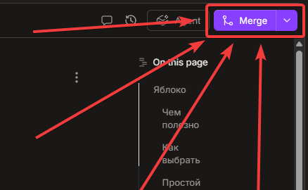<figcaption></figcaption></figure></div>

После публикации нужно подождать примерно минуту (зависит от объёма страницы и изменений). Готово - ваша документация в интернете.

### Настройка внешнего вида

Если хотите изменить стиль (например, включить тёмную тему), зайдите в **Docs Sites** (нажав на название вашего сайта), а затем сверху выберите вкладку **"Customization"**.

<div data-with-frame="true"><figure>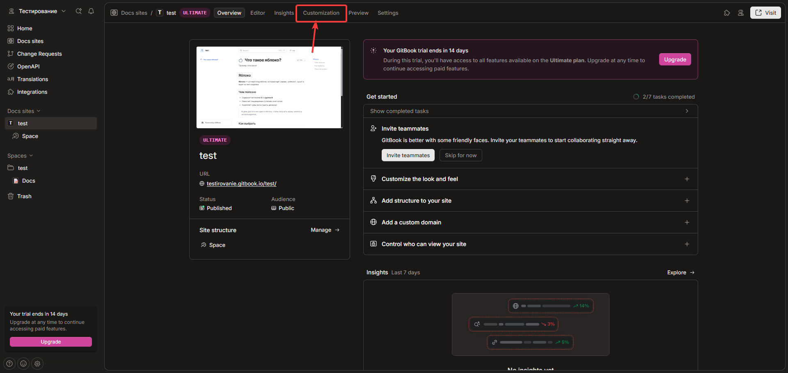<figcaption></figcaption></figure></div>

Пролистайте чуть ниже до раздела **"Modes"**. Там можно переключить тему с **Light** на **Dark** и поиграть с другими настройками. Справа будет предпросмотр, а снизу кнопка **Save** для сохранения.

<div data-with-frame="true"><figure>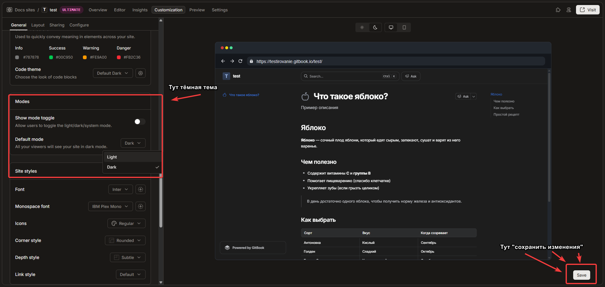<figcaption></figcaption></figure></div>

***

На этом базовое знакомство с GitBook можно считать законченным. Дальше - дело практики: пишите статьи, смотрите видео на YouTube, экспериментируйте с блоками и выкладывайте свои документации.
