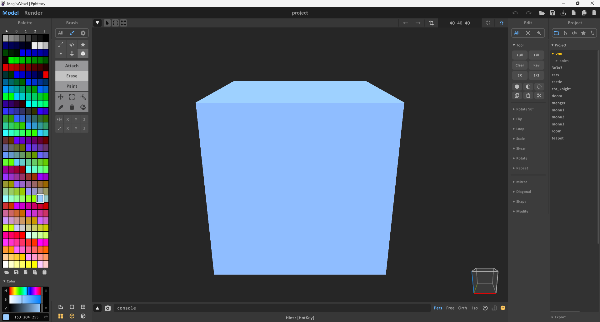

# MagicaVoxel - Рисуй пикселями

**Давайте честно,** делать 3D-модельки в Blender или даже Blockbench - **относительно сложно**. А что, если хочется собрать что-то из трёхмерных пикселей, но без скурпулёзного моделирования каждой точки? На этот случай я хочу показать вам одну из древнейших, но до сих пор живых программ - **MagicaVoxel**.




**Воксель (Voxel)** - если по-простому, это 3D-пиксель. Как в Minecraft, только здесь ты можешь покрасить каждый кубик в свой цвет и поставить его куда захочешь.




Сама программа появилась в **2014 году**. Долгое время она оставалась малоизвестной, но всё же у неё были поклонники. На моей личной памяти, в русскоязычном комьюнити был как минимум один человек, кто использовал её по назначению - [**Хауди Хо**](https://www.youtube.com/watch?v=JUcCnulhHlQ) (он делал 3D-игру по мотивам [динозаврика из Google Chrome](https://ru.wikipedia.org/wiki/Dinosaur_Game)).&#x20;

<figure><figcaption></figcaption></figure>

Сам интерфейс - **максимально простой**. Слева ты выбираешь цвет и инструмент (кисточка, ластик, заливка и т.д.). Цветов ограниченное количество - максимум **256 оттенков** в одной палитре. Справа - библиотека сохранённых моделей (там уже лежат несколько примеров, чтобы посмотреть, на что способна программа).

<figure><figcaption></figcaption></figure>

**Главная фишка** MagicaVoxel - она умеет экспортировать свои модели в **OBJ, PLY, PNG** и другие форматы. Этого хватает, чтобы закинуть модель в Blender, напечатать на 3D-принтере или просто сделать красивый рендер.

Кстати, в левом верхнем углу есть два режима:

* **Моделирование** - строишь кубики.
* **Рендер** - делаешь картинку красивой.

**Про рендер:** у MagicaVoxel свой собственный движок. По сути, это **упрощённый аналог профессиональных движков** типа Corona Renderer или V-Ray. Он работает с лучами света (трассировка лучей), поэтому картинка получается объёмная, с тенями, бликами и отражениями — прямо как фото.

<figure><figcaption></figcaption></figure>


#### Техническая часть

* **Последняя версия на момент 22.02.2026:** **0.99.22** (от 11 января 2026)
* **Русский язык:** официально **нет**. Только английский. Но энтузиасты делали **любительские русификаторы** (файлы локализации от сообщества) - можно найти, если погуглить.
* **Вес программы:** **\~27 МБ** (в распакованном виде). Легче некуда.
* **Кросс-платформенность:** **нет**. Только **Windows** (7/8/10/11). На Mac или Linux официально не работает (только через эмуляторы, но это танцы с бубном).
* **Разработчик:** один парень под ником **ephtracy**.



#### ⚠️ Единственный жирный минус

Разработчик **забросил активную разработку MagicaVoxel**. Он жив, здоров и даже кодит — но теперь другие проекты:

* **Archimat** - движок для архитектурного моделирования (здания, этажи, планировки).
* **Vengine** - его собственный игровой воксельный движок.

Последнее обновление (0.99.22) - скорее **косметическое** и фикс багов. Так что **нового функционала можно не ждать**. Но программа и так хороша - как швейцарский нож, который уже не точат, но он всё ещё режет.




### Примеры работ из комьюнити

<figure><figcaption></figcaption></figure>

<figure><figcaption></figcaption></figure>

<figure><figcaption></figcaption></figure>

<figure><figcaption></figcaption></figure>

